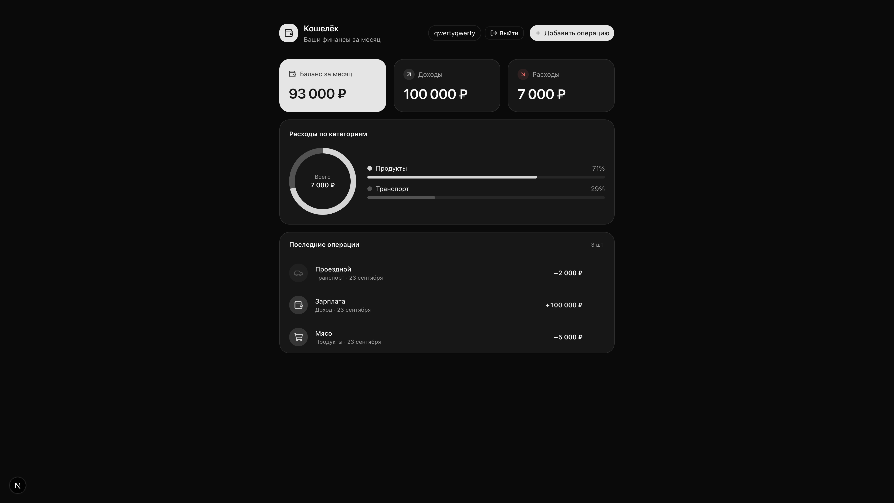
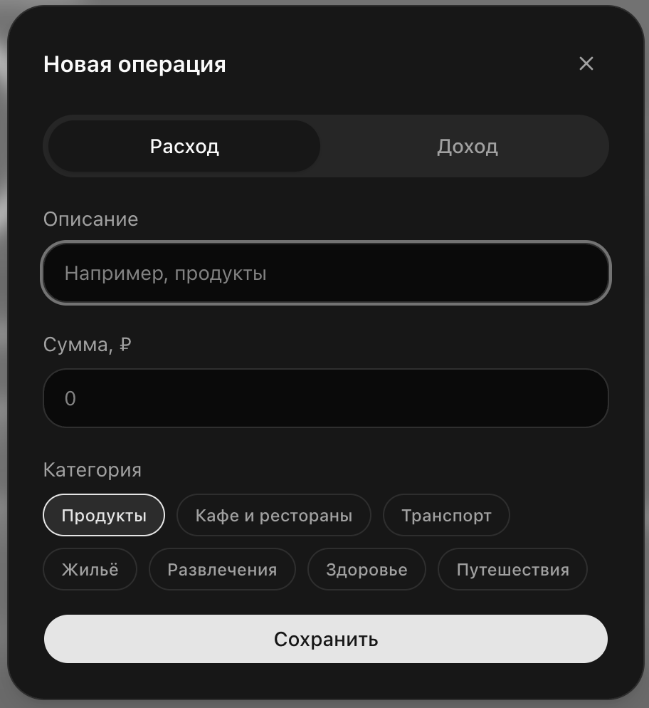
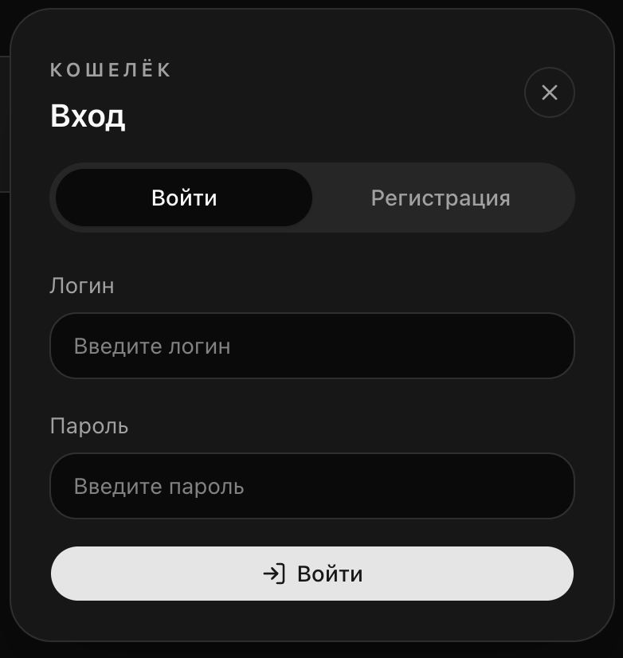

# Кошелёк — трекер личных финансов

Полноценный full-stack pet project для учёта доходов и расходов. Пользователь создаёт аккаунт, добавляет операции, видит текущий баланс и анализирует расходы по категориям.

Проект показывает навыки разработки приложения целиком: от модели данных и REST API до авторизации, адаптивного интерфейса и связи между frontend и backend.

## Что умеет приложение

- регистрация, вход и выход из аккаунта;
- отдельный список операций для каждого пользователя;
- добавление доходов и расходов;
- категории расходов: продукты, кафе, транспорт, жильё, развлечения, здоровье и путешествия;
- сводные карточки баланса, доходов и расходов;
- круговая диаграмма и процентная разбивка расходов по категориям;
- сортировка операций по дате;
- удаление операции;
- адаптивная вёрстка для компьютера и мобильных устройств;
- защита запросов через сессионную авторизацию и CSRF-токены.

## Стек

### Frontend

- Next.js 16;
- React 19;
- TypeScript;
- Tailwind CSS 4;
- Lucide React.

### Backend

- Python;
- Django 6;
- Django REST Framework;
- SQLite.

## Как устроен проект

```text
Браузер :3000
    │
    ▼
Next.js frontend
    │  /backend/* → proxy/rewrite
    ▼
Django + DRF :8000
    │
    ▼
SQLite
```

Frontend работает на `http://127.0.0.1:3000` и отправляет запросы через Next.js proxy. Backend работает на `http://127.0.0.1:8000`, хранит данные в SQLite и возвращает пользователю только его собственные операции.

## Структура репозитория

```text
.
├── ExpenseTracker/              # Django-проект
│   ├── expenses/                # транзакции, категории и REST API
│   ├── users/                   # регистрация пользователей
│   ├── ExpenseTracker/          # настройки и маршруты Django
│   └── manage.py
├── ExpenseTrackerFrontend/      # Next.js-приложение
│   ├── app/                     # страницы и глобальные стили
│   ├── components/              # UI-компоненты
│   └── lib/                     # типы, форматирование и API-клиент
└── run-project.sh               # запуск frontend и backend одной командой
```

## Запуск локально

### Вариант 1: одной командой

Нужны Python, Node.js и npm.

```bash
git clone <URL-репозитория>
cd ExpenseTracker

python3 -m venv .venv
source .venv/bin/activate
python -m pip install "Django>=6,<7" djangorestframework

chmod +x run-project.sh
./run-project.sh
```

Скрипт автоматически:

1. применит миграции Django;
2. запустит backend на `127.0.0.1:8000`;
3. установит frontend-зависимости при необходимости;
4. запустит Next.js на `127.0.0.1:3000`.

После запуска откройте [http://127.0.0.1:3000](http://127.0.0.1:3000).

### Вариант 2: запустить сервисы отдельно

Backend:

```bash
cd ExpenseTracker
python manage.py migrate
python manage.py runserver 127.0.0.1:8000
```

В другом терминале frontend:

```bash
cd ExpenseTrackerFrontend
cp .env.example .env.local
npm install
npm run dev
```

## Основные API-маршруты

| Метод | Маршрут | Назначение |
|---|---|---|
| `POST` | `/api-auth/register/` | регистрация пользователя |
| `GET` | `/api/v1/transactions/` | список операций текущего пользователя |
| `POST` | `/api/v1/transactions/` | создание операции |
| `GET` | `/api/v1/transactions/<id>/` | получение одной операции |
| `PATCH` | `/api/v1/transactions/<id>/` | изменение операции через API |
| `DELETE` | `/api/v1/transactions/<id>/` | удаление операции |

Для браузерного интерфейса эти запросы доступны через префикс `/backend`, например `/backend/api/v1/transactions/`.

## Как показать проект на презентации

Лучший сценарий демонстрации занимает 2–3 минуты:

1. Зарегистрировать нового пользователя.
2. Добавить доход: «Зарплата» — `120 000 ₽`.
3. Добавить несколько расходов: продукты, аренда, кафе и транспорт.
4. Показать, как пересчитались баланс и общая сумма расходов.
5. Показать разбивку по категориям.
6. Удалить одну операцию и продемонстрировать обновление списка.

Для выразительного скриншота удобно использовать такой набор тестовых данных:

| Тип | Описание | Сумма |
|---|---|---:|
| Доход | Зарплата | 120 000 ₽ |
| Расход | Аренда | 35 000 ₽ |
| Расход | Продукты | 8 500 ₽ |
| Расход | Кафе | 3 200 ₽ |
| Расход | Транспорт | 2 500 ₽ |
| Расход | Развлечения | 1 800 ₽ |

## Скриншоты

<p align="center">
  
</p>

<p align="center">
  
  
</p>

## Идеи для следующей версии

- фильтр операций по периоду и категории;
- редактирование существующей операции в интерфейсе;
- экспорт данных в CSV;
- отдельная статистика по месяцам;
- деплой frontend и backend в облако.

## Статус проекта

Проект создан как учебное full-stack приложение и демонстрация практических навыков: проектирование моделей, REST API, авторизация, работа с cookies и CSRF, интеграция frontend с backend и построение интерфейса на React.

Перед публикацией в production стоит вынести `SECRET_KEY` в переменные окружения, отключить `DEBUG` и настроить `ALLOWED_HOSTS` в `settings.py`.
